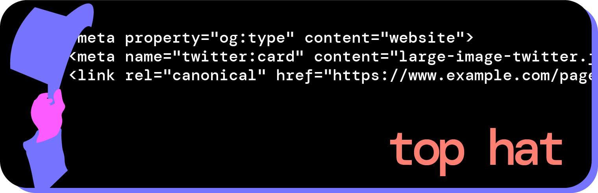

# Tophat 🎩
A featureful meta tag / head boilerplate updated for 2023 web standards.

## Release Notes

### v1.0.*

-cleaned up documentation

## Usage ⌨️

Start typing `Tophat*"` in an HTML file and select the snippet from the menu in order

Here's what's included:

## Installation 💻

You can download the package [here via the VSCode marketplace](https://marketplace.visualstudio.com/items?itemName=remyhunt.tophat) or search for it in the Extensions sidebar within VSCode.

## File Types

Supported file types are included in `contributes` object of the `package.json` 
Currently supporting `*.html` and `*.json` files.

## Issues 🗩

If you have any issues report them at [Issues](https://github.com/remyhunt/tophat-vsc/issues)

## Source

[Github](https://github.com/remyhunt/tophat-vsc/)

## Contributors

[remy hunter](https://github.com/remyhunt/)

## Credits and Thanks

This extension was inspired by [this](https://github.com/h5bp/html5-boilerplate/blob/master/src/index.html) popular github repository for HTML5 boilerplate, and this [blog post](https://www.matuzo.at/blog/html-boilerplate/) by Manuel Manuel Matuzovic. The markup used are all common and good  practices for SEO and accesibility. The writer of this post elegantly published the markup with details and justification line-by-line. I highly recommend visiting that post.